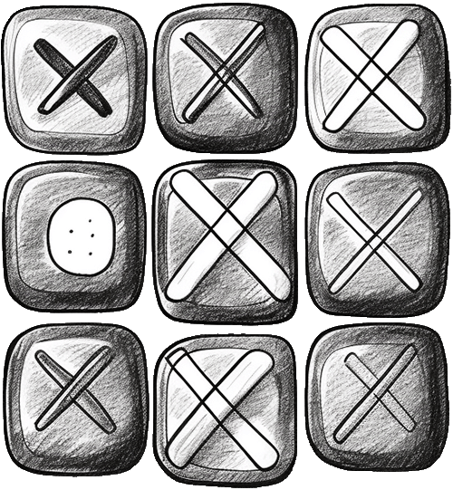

# Tic-Tac-Toe

A two-player Tic-Tac-Toe game for a single device, built with React and TypeScript. A learning project from the **React — The Complete Guide** course.

<p align="center">
  
</p>

## Features

- 3×3 board, players take turns (**X** goes first)
- Highlights the player whose turn it is
- Editable player names (**Edit** / **Save** buttons)
- Winner detection across all 8 winning combinations (3 rows, 3 columns, 2 diagonals)
- Draw detection when the board is full
- **Game Over** screen showing the winner's name, with a **Restart!** button to start a new game
- Occupied squares are disabled and can't be played again

## Tech Stack

- [React 19](https://react.dev/)
- [TypeScript](https://www.typescriptlang.org/)
- [Vite](https://vite.dev/)
- ESLint

## Getting Started

Requires [Node.js](https://nodejs.org/) (LTS recommended).

```bash
git clone https://github.com/alinahusak/react-tic-tac-toe.git
cd react-tic-tac-toe
npm install
npm run dev
```

Then open the URL printed by Vite in your browser (http://localhost:5173 by default).

## Scripts

| Command           | Description                                            |
| ----------------- | ------------------------------------------------------ |
| `npm run dev`     | Start the dev server with hot reload                   |
| `npm run build`   | Type-check and build the production bundle into `dist/` |
| `npm run preview` | Preview the production build locally                   |
| `npm run lint`    | Run ESLint                                             |

## Project Structure

```
src/
├── App.tsx                  # Game state, turn logic, winner/draw detection
├── components/
│   ├── GameBoard.tsx        # The 3×3 game board
│   ├── Player.tsx           # Player card with editable name
│   ├── GameOver.tsx         # Game over screen and restart
│   └── Log.tsx              # Placeholder for a move log (not used yet)
├── winning-combinations.ts  # List of winning combinations
├── main.tsx                 # Entry point
└── index.css                # Styles
```

## How It Works

The only piece of game state is the `gameTurns` array in `App.tsx`. Everything else is derived from it on each render:

- **active player** — the opposite of whoever made the last move;
- **game board** — rebuilt from an empty board by replaying the turns;
- **winner** — checked against every combination in `winning-combinations.ts`;
- **draw** — 9 moves made and no winner.

Restarting the game simply clears the turns array.
